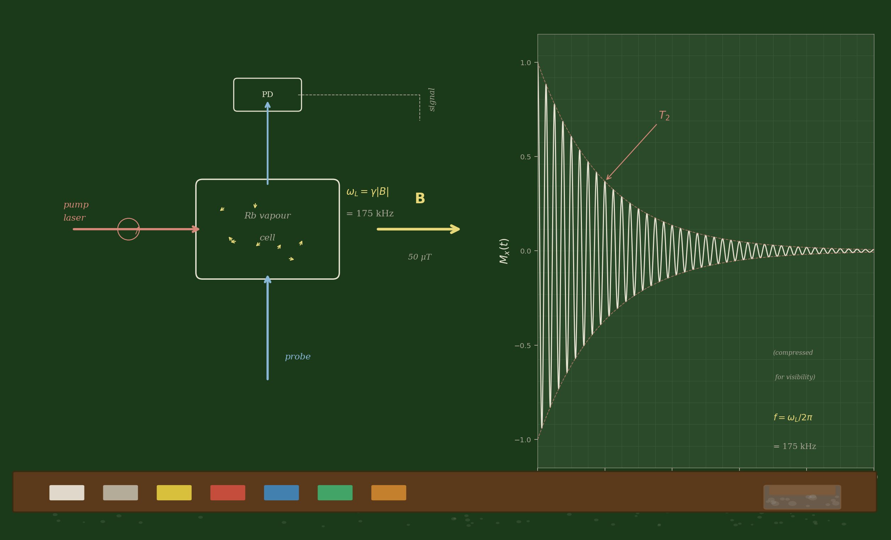
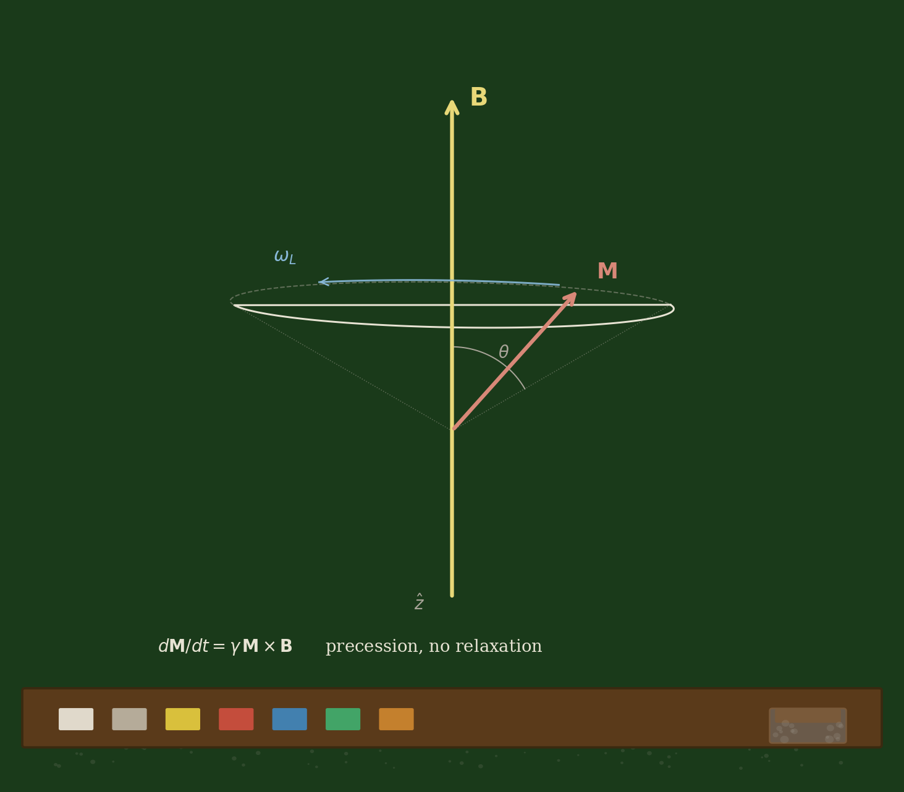
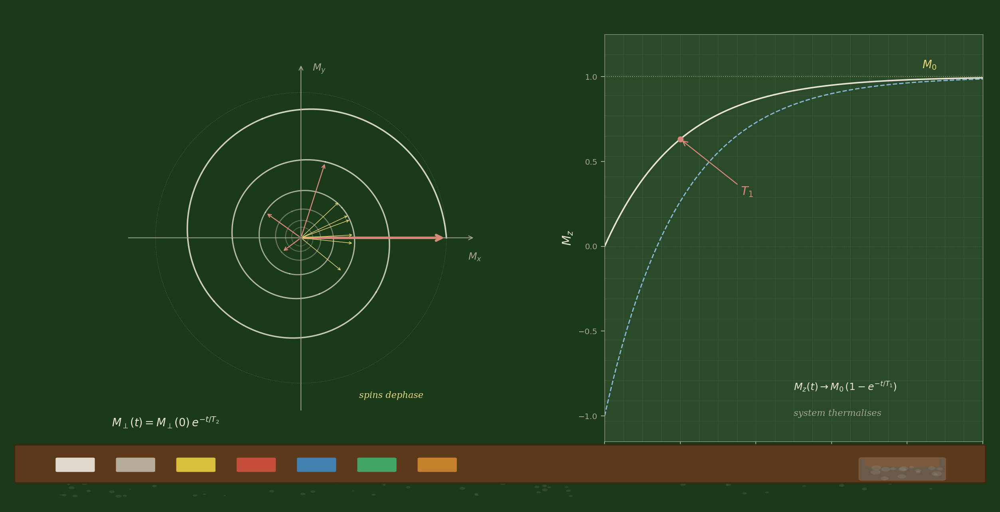
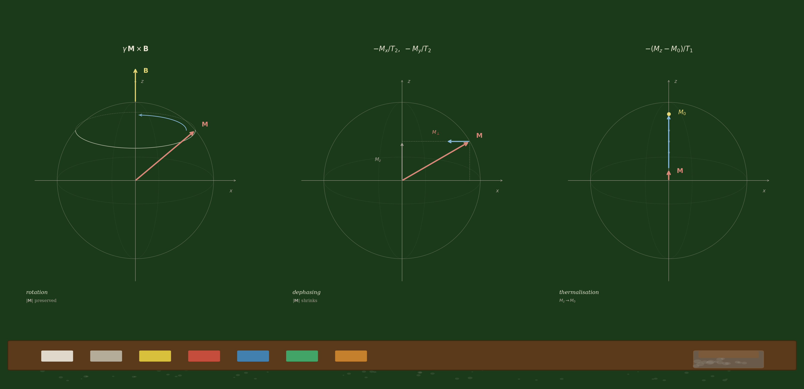
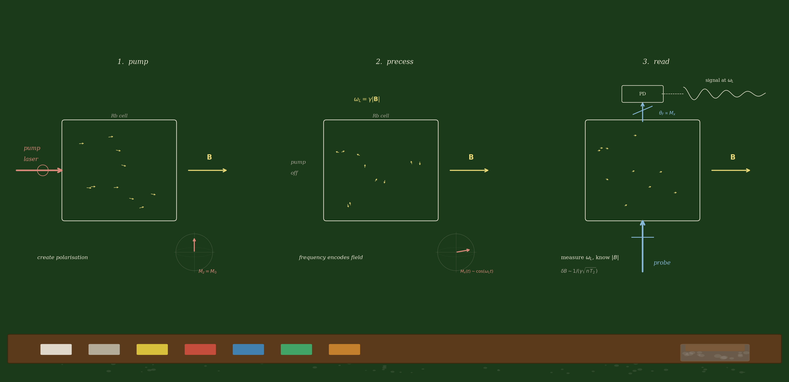

#+title: Lesson 00 — The Bloch Equations
#+subtitle: What a Spinning Atom Does in a Magnetic Field
#+author: MāyāPramāṇa
#+date: February 2026
#+LOOM: lesson
#+DEFINES: BlochState BlochParams bloch_derivative rk4_step simulate rb87Params
#+DEPENDS: (none)
#+EXPORTS: chalkboard_setup.png chalkboard_precession_cone.png chalkboard_relaxation.png chalkboard_bloch_terms.png chalkboard_magnetometer.png bloch_precession.png
#+CADENZAS: spin-in-a-field why-it-precesses bloch-sphere-geometry relaxation-physics numerical-ode-methods atomic-magnetometry
#+property: header-args :mkdirp yes :eval never-export
#+property: header-args:python :session bloch :results output :eval no-export
#+property: header-args:haskell :tangle ../../haskell/src/Physics/Bloch.hs
#+property: header-args:cpp :tangle ../../cpp/src/core/bloch.hpp

#+begin_comment
Activate the project virtual environment and set PYTHONPATH so that
both :session and :session none blocks find the mayapramana package.
Run this block first (C-c C-c) when opening the notebook.
#+end_comment
#+begin_src elisp :results silent :eval no-export
(let* ((lesson-dir (file-name-directory (buffer-file-name)))
       (project-root (expand-file-name "../.." lesson-dir))
       (venv-dir (expand-file-name ".venv" project-root))
       (python-dir (expand-file-name "python" project-root)))
  ;; Activate venv — sets python-shell-interpreter for ob-python
  (pyvenv-activate venv-dir)
  ;; Add the python/ tree to PYTHONPATH so all blocks can import mayapramana
  (setenv "PYTHONPATH"
          (let ((existing (getenv "PYTHONPATH")))
            (if (and existing (string-match-p (regexp-quote python-dir) existing))
                existing
              (if existing
                  (concat python-dir ":" existing)
                python-dir))))
  (message "MāyaPramāṇa: venv %s, PYTHONPATH includes %s" venv-dir python-dir))
#+end_src

#+begin_comment
Smoke-test: verify the Python session can import everything.
#+end_comment
#+name: notebook-init
#+begin_src python :results output :eval no-export
import numpy as np
from dataclasses import dataclass
print(f"Python session ready. NumPy {np.__version__}")
#+end_src

#+begin_quote
I think I can safely say that nobody understands quantum mechanics.
--- Richard Feynman, /The Character of Physical Law/, 1964
#+end_quote

And yet. Put a rubidium atom in a magnetic field, and it does something definite. Something precise. Something you can watch.

Let's watch it, and then figure out why it does what it does.

* A Spinning Atom

#+begin_src python :results file :file chalkboard_setup.png :session none :eval no-export
import illustrate as ill
ill.setup()
#+end_src

#+ATTR_ORG: :width 800

Here is the setup. On the left: a glass cell full of rubidium-87 vapour. A circularly polarised pump laser (red) prepares the atoms — we will get to how in the next lesson; for now, just accept that after the laser does its work, the atoms are spinning. A probe laser (blue) passes through the cell and hits a photodetector. The cell sits in a magnetic field $\mathbf{B}$ — about 50 microtesla, roughly the Earth's field.

On the right: what the photodetector sees. An oscillating signal — the atoms precessing — inside a decaying envelope. The oscillation frequency is 175 kHz. The envelope decays in about 10 milliseconds.

That is the whole story of this lesson, in one picture. The rest is figuring out /why/ the signal looks like that.

What happens?

The atoms precess. Each one is a tiny spinning magnet, and it precesses about the magnetic field like a gyroscope precesses about gravity. Not metaphorically — /exactly/ like a gyroscope. The magnetic field exerts a torque on the magnetic moment, and the torque is perpendicular to the spin, so the spin doesn't align with the field — it orbits around it.

If you could watch a single atom (you can't, but play along), you would see its spin axis trace out a cone around the field direction.

#+begin_src python :results file :file chalkboard_precession_cone.png :session none :eval no-export
import illustrate as ill
ill.precession_cone()
#+end_src

#+ATTR_ORG: :width 600

The rate of this precession is the Larmor frequency:

$$\omega_L = \gamma |\mathbf{B}|$$

where $\gamma$ is the gyromagnetic ratio — a number that tells you how fast the spin responds to the field. For rubidium-87 in the $F=2$ ground state, $\gamma / 2\pi \approx 3.5 \text{ GHz/T}$, so at 50 microtesla the precession frequency is about 175 kHz.

175,000 revolutions per second. Each revolution takes about 5.7 microseconds. The atom doesn't know it's in an instrument, doesn't know we're measuring — it just spins, steady as a clock.

That is remarkable. And that is the clock an atomic magnetometer reads.

#+BEGIN_CADENZA
:concept       spin-in-a-field
:knows         classical-mechanics angular-momentum torque
:needs         magnetic-moment gyroscope-analogy larmor-precession
:prereqs       classical-mechanics angular-momentum
:assumes       (nothing — this is the first encounter)
:anti-targets  quantum-field-theory relativistic-spin
:connects-to   why-it-precesses
You have seen a gyroscope precess under gravity. The analogy to a
magnetic moment in a field is exact at the classical level: the torque
$\boldsymbol{\tau} = \boldsymbol{\mu} \times \mathbf{B}$ is
perpendicular to $\boldsymbol{\mu}$, so the angular momentum
precesses rather than aligning. Walk through this — why perpendicular
torque causes precession, not alignment. Start from $d\mathbf{L}/dt =
\boldsymbol{\tau}$ and show that if $\boldsymbol{\tau} \perp
\mathbf{L}$, the magnitude $|\mathbf{L}|$ is constant and the
direction rotates. Use the gyroscope as the concrete example, then map
to the magnetic case: $\boldsymbol{\mu} = \gamma \mathbf{L}$, so
$d\boldsymbol{\mu}/dt = \gamma \boldsymbol{\mu} \times \mathbf{B}$.
#+END_CADENZA

* Why It Precesses

Let's write down the equation. A magnetic moment $\boldsymbol{\mu}$ in a field $\mathbf{B}$ feels a torque:

$$\boldsymbol{\tau} = \boldsymbol{\mu} \times \mathbf{B}$$

The torque changes the angular momentum: $d\mathbf{L}/dt = \boldsymbol{\tau}$. And the magnetic moment is proportional to the angular momentum: $\boldsymbol{\mu} = \gamma \mathbf{L}$. So:

$$\frac{d\boldsymbol{\mu}}{dt} = \gamma \boldsymbol{\mu} \times \mathbf{B}$$

That's it. That's the equation. Let me call the magnetic moment
$\mathbf{M}$ instead of $\boldsymbol{\mu}$ (the convention in the
Bloch equation literature), and there it is:

$$\frac{d\mathbf{M}}{dt} = \gamma \mathbf{M} \times \mathbf{B}$$

Let's make sure we believe this. The cross product $\mathbf{M} \times
\mathbf{B}$ is perpendicular to both $\mathbf{M}$ and $\mathbf{B}$. So $d\mathbf{M}/dt$ is perpendicular to $\mathbf{M}$ — the spin changes direction but not magnitude. And $d\mathbf{M}/dt$ is perpendicular to $\mathbf{B}$ — the motion is /around/ the field, not toward it or away from it.

This is precession. $|\mathbf{M}|$ stays constant (the spin doesn't speed up or slow down). The component of $\mathbf{M}$ along $\mathbf{B}$ stays constant (the cone angle doesn't change). The transverse components rotate at angular frequency $\omega_L = \gamma |\mathbf{B}|$.

Now here is something that should give you pause. I derived this classically — torque on a magnetic moment, angular momentum, cross products. But the atom is a quantum object. It has spin $F = 2$, five magnetic sublevels, a Hilbert space. Shouldn't the quantum story be different?

#+BEGIN_CADENZA
:concept       why-it-precesses
:knows         classical-precession torque cross-product
:needs         ehrenfest-theorem quantum-classical-correspondence
:prereqs       quantum-mechanics-basics expectation-values
:assumes       larmor-frequency gyromagnetic-ratio
:anti-targets  path-integrals decoherence-theory
:connects-to   bloch-sphere-geometry
The classical equation $d\mathbf{M}/dt = \gamma \mathbf{M} \times
\mathbf{B}$ is exact for quantum expectation values — this is
Ehrenfest's theorem applied to spin. The Hamiltonian is $H = -\gamma
\mathbf{S} \cdot \mathbf{B}$, and $d\langle\mathbf{S}\rangle/dt =
(i/\hbar)\langle[H, \mathbf{S}]\rangle = \gamma
\langle\mathbf{S}\rangle \times \mathbf{B}$. Walk through this
commutator calculation using $[S_i, S_j] = i\hbar\epsilon_{ijk}S_k$.
The result is that the classical precession equation holds exactly for
the expectation values, with no corrections. This is special to linear
Hamiltonians — it would not be true for, say, a quartic potential.
For the collaborator who knows quantum mechanics but is surprised the
classical equation is exact: explain why, and where it breaks down
(nonlinear Zeeman shifts at high fields).
#+END_CADENZA

It turns out the classical equation is /exactly right/ for the quantum expectation values. Ehrenfest's theorem gives you:

$$\frac{d\langle\mathbf{S}\rangle}{dt} = \gamma \langle\mathbf{S}\rangle \times \mathbf{B}$$

Same equation. Same cross product. Same precession. The quantum atom precesses just like a classical gyroscope. (This is a special property of the spin Hamiltonian $H = -\gamma \mathbf{S} \cdot \mathbf{B}$, which is linear in $\mathbf{S}$. For nonlinear Hamiltonians, the classical and quantum stories diverge. But for precession in a uniform field, they agree exactly.)

So $\mathbf{M} = \langle\mathbf{S}\rangle / \hbar$ (normalised however you like — the proportionality is what matters), and our classical equation governs the quantum expectation value. Good. We can trust it.

* But It Doesn't Last

If precession were the whole story, the atom would spin forever. Set it going, come back a year later, still precessing at 175 kHz. A perfect clock.

It doesn't.

The precession decays. The transverse components — $M_x$ and $M_y$, the ones that oscillate — get smaller over time. The oscillation fades. After a few milliseconds (in a typical vapour cell), the signal is gone.

Why?

Because the atom is not alone. It lives in a cell with $10^{12}$ other rubidium atoms, plus a buffer gas (nitrogen, maybe argon). It collides with them. It bounces off the cell walls. Each collision is a tiny random perturbation — a nudge to the spin. And these nudges add up.

There are two kinds of damage:

** Phase decoherence ($T_2$)

The transverse components $M_x$ and $M_y$ oscillate in phase. That's
what makes them a signal — all the atoms precess together, in sync.
But each collision shifts the phase of one atom by a random amount. After
many collisions, the atoms are still precessing, but they've lost
their synchrony. Some are ahead, some behind. The /average/ transverse
magnetisation — which is what we measure — decays to zero.

This is characterised by the time $T_2$, the transverse relaxation
time. In a rubidium vapour cell, $T_2$ is typically a few
milliseconds (limited by collisions) to a few hundred milliseconds
(in cells with anti-relaxation wall coatings).

The transverse components decay as:

$$M_x(t) \sim M_x(0) \cos(\omega_L t) \, e^{-t/T_2}$$

An oscillation inside a decaying envelope. This is the free induction decay — the signal a magnetometer actually sees.

** Energy relaxation ($T_1$)

The longitudinal component $M_z$ — the projection of the spin onto
the field axis — also changes, but for a different reason. Collisions
can flip the spin, transferring the atom between magnetic sublevels.
This changes $M_z$. Over time, the spin population thermalises: the
atoms distribute themselves among the sublevels according to the
Boltzmann distribution, and $M_z$ approaches the thermal equilibrium
value $M_0$.

This is characterised by $T_1$, the longitudinal relaxation time.
$T_1 \geq T_2$ always — you can lose phase coherence without changing
the energy distribution, but you can't change the energy distribution
without also losing phase coherence.

In a rubidium vapour cell, $T_1$ is typically 10-100 ms.

#+begin_src python :results file :file chalkboard_relaxation.png :session none :eval no-export
import illustrate as ill
ill.relaxation()
#+end_src

#+ATTR_ORG: :width 800

#+BEGIN_CADENZA
:concept       relaxation-physics
:knows         thermodynamics statistical-mechanics collisions
:needs         T1-T2-mechanisms spin-relaxation decoherence-physical-picture
:prereqs       statistical-mechanics boltzmann-distribution
:assumes       precession larmor-frequency bloch-vector
:anti-targets  lindblad-master-equation quantum-channels
:connects-to   atomic-magnetometry
What are the actual physical mechanisms behind $T_1$ and $T_2$ in a
rubidium vapour cell? Walk through the main relaxation mechanisms:
(1) spin-exchange collisions (Rb-Rb) — two atoms collide and swap
spin states, preserving total spin but randomising individual phases;
(2) spin-destruction collisions (Rb-buffer gas) — the spin is
randomised, destroying both phase and population; (3) wall collisions
— the atom hits the cell wall and the spin is randomised. Explain why
anti-relaxation coatings (paraffin, alkene) help: they preserve spin
coherence through hundreds of wall bounces. Mention SERF
(spin-exchange relaxation-free) as the regime where spin-exchange
broadening vanishes at zero field. The collaborator knows
thermodynamics and statistical mechanics but has not thought about
spin relaxation in gases.
#+END_CADENZA

* The Bloch Equations

Now we can write the full equation. Take the precession equation and
add the two relaxation terms:

$$\frac{d\mathbf{M}}{dt} = \gamma \mathbf{M} \times \mathbf{B}
  - \begin{pmatrix} M_x / T_2 \\ M_y / T_2 \\ (M_z - M_0) / T_1 \end{pmatrix}$$

Three terms, three kinds of physics:

1. $\gamma \mathbf{M} \times \mathbf{B}$ — precession. Pure,
   reversible, the atom doing its thing.

2. $-M_x / T_2$, $-M_y / T_2$ — transverse decay. The environment
   destroying phase coherence. Irreversible.

3. $-(M_z - M_0) / T_1$ — longitudinal relaxation. The system
   thermalising. Also irreversible.

#+begin_src python :results file :file chalkboard_bloch_terms.png :session none :eval no-export
import illustrate as ill
ill.bloch_terms()
#+end_src

#+ATTR_ORG: :width 800

These are the Bloch equations. Felix Bloch wrote them down in 1946
for nuclear spins in NMR. They apply equally to atomic spins in a
magnetometer, to electron spins in ESR, to any spin-½-like system in
a field with an environment.

Notice what we did. We started with a phenomenon (precession), asked
why it decays (collisions), and wrote down the simplest equation that
captures both the precession and the decay. We did not start from the
Schr\ouml{}dinger equation. We did not invoke the density matrix. We did
not need Hilbert spaces. The Bloch equations are /phenomenological/
— they describe what happens, parametrised by $\gamma$, $T_1$, $T_2$,
and $M_0$.

The derivation from the quantum master equation (the Lindblad
equation) comes in Lesson 02. But the physics is here, right now, in
this equation.

** The Bloch vector on the sphere

One more thing before we build it. The vector $\mathbf{M} = (M_x,
M_y, M_z)$ lives in $\mathbb{R}^3$. If there is no relaxation
($T_1, T_2 \to \infty$), the precession equation preserves
$|\mathbf{M}|$ — pure rotation. So the tip of $\mathbf{M}$ traces a
circle on a sphere.

With relaxation, $|\mathbf{M}|$ shrinks — the point spirals inward.
In the quantum language, this is the state becoming /mixed/:
entangled with the environment, losing purity. The sphere surface is
pure states; the interior is mixed states; the centre is complete
ignorance.

This is the Bloch sphere. We will use it throughout the curriculum.

#+BEGIN_CADENZA
:concept       bloch-sphere-geometry
:knows         linear-algebra complex-numbers bloch-vector-definition
:needs         bloch-sphere-representation state-visualisation pure-vs-mixed
:prereqs       linear-algebra complex-numbers
:assumes       precession relaxation bloch-equations
:anti-targets  higher-spin-systems qubit-gates
:connects-to   numerical-ode-methods
Why does the Bloch vector live on a sphere? For the collaborator who
wants the algebraic argument: a 2×2 density matrix has 3 real degrees
of freedom (Hermitian + unit trace), the Pauli matrices form a basis
for the traceless part, and positive semi-definiteness constrains
$|\mathbf{M}| \leq 1$. Walk through the parametrisation
$\rho = \frac{1}{2}(\mathbf{I} + \mathbf{M}\cdot\boldsymbol{\sigma})$,
the eigenvalue relation $\lambda_\pm = \frac{1}{2}(1 \pm |\mathbf{M}|)$,
and the purity formula $\mathrm{Tr}(\rho^2) = \frac{1}{2}(1 + |\mathbf{M}|^2)$.
Distinguish between "mixed because we don't know" (classical
ignorance) and "mixed because entangled" (quantum decoherence) — the
density matrix does not distinguish the two, but the physics does.
#+END_CADENZA

* Why This Is a Magnetometer

Step back and look at what we have.

The atoms precess at $\omega_L = \gamma |\mathbf{B}|$. The precession
frequency is proportional to the magnetic field strength. Measure the
frequency, and you know the field.

An atomic magnetometer works in three steps:

1. *Pump* — a circularly polarised laser optically pumps the atoms,
   creating a large spin polarisation ($M_z \gg 0$). This is the
   initial condition. (Lesson 01 will develop this.)

2. *Precess* — in the Bell-Bloom scheme, the pump is modulated at the
   Larmor frequency, synchronously driving the precession. Or the pump
   is turned off, and the spins precess freely (free induction decay).
   Either way, the transverse components oscillate at $\omega_L$.

3. *Read* — a linearly polarised probe beam passes through the cell.
   The precessing spins rotate the polarisation (Faraday rotation) by
   an angle proportional to $M_x(t)$. A photodetector and a polariser
   convert this into an electrical signal oscillating at $\omega_L$.

#+begin_src python :results file :file chalkboard_magnetometer.png :session none :eval no-export
import illustrate as ill
ill.magnetometer()
#+end_src

#+ATTR_ORG: :width 800

The sensitivity — how small a field change you can detect — is
limited by:

$$\delta B \sim \frac{1}{\gamma \sqrt{n \, T_2}}$$

where $n$ is the number of atoms and $T_2$ is the coherence time.
More atoms, better. Longer coherence, better. This is why anti-relaxation
coatings and SERF magnetometers are important: they extend $T_2$.

The best atomic magnetometers reach femtotesla sensitivity — measuring
fields a billion times weaker than the Earth's. They detect magnetic
fields from the human brain, from geological structures, from
submarines. All from this equation: $d\mathbf{M}/dt = \gamma
\mathbf{M} \times \mathbf{B} - \text{relaxation}$.

#+BEGIN_CADENZA
:concept       atomic-magnetometry
:knows         electromagnetic-waves optics bloch-equations
:needs         atomic-sensors bell-bloom-principle magnetometer-signal-chain
:prereqs       electromagnetic-waves optics
:assumes       bloch-equations larmor-frequency T1-T2-relaxation
:anti-targets  SQUID-engineering cryogenics
:connects-to   optical-pumping-lesson-01
How does a set of differential equations become a magnetic field
measurement? Walk through the three stages concretely for an
optically pumped magnetometer (OPM): (1) Optical pumping — a
circularly polarised laser drives transitions that accumulate
population in one Zeeman sublevel, creating a large $M_z$. Connect
to the Bloch equations: pumping is an effective $M_0$ term.
(2) Precession — the pump is turned off (or a dark period begins),
and the spin precesses at the Larmor frequency $\omega_L = \gamma|B|$.
This is the cross-product term, pure rotation. (3) Readout — a
linearly polarised probe beam acquires Faraday rotation proportional
to $M_x$, converting spin dynamics into an optical signal. The
sensitivity limit is set by spin-projection noise:
$\delta B \sim 1/(\gamma \sqrt{n T_2})$, where $n$ is the atom
number. Mention that SERF magnetometers (spin-exchange relaxation
free) achieve fT/$\sqrt{\text{Hz}}$ by operating at zero field where
spin-exchange collisions stop broadening. The collaborator understands
the Bloch equations from this lesson but has not seen how they
connect to an actual sensor.
#+END_CADENZA

* Building the Equations

Now we build it. Three languages, one physics.

We need:
- A type for the Bloch vector state $\mathbf{M}$
- A type for the physical parameters ($\gamma$, $T_1$, $T_2$, $M_0$)
- The derivative function: given $\mathbf{M}$ and $\mathbf{B}$,
  compute $d\mathbf{M}/dt$
- An integrator: given a derivative function, step forward in time
- A simulation: fold the integrator over many time steps

The derivative function is /pure/ — same inputs, same output, no side
effects. This is not a design choice; it is what the physics demands.
The Bloch equations are deterministic given the state, field, and
parameters. Stochastic effects (noise, measurement back-action) come
later, as a separate layer.

** Implementation: Python

We begin with Python because we can run it here, in the document,
and see the results immediately.

*** Constants and Types

#+begin_src python
import numpy as np
from dataclasses import dataclass

@dataclass
class BlochState:
    """The Bloch vector M = (Mx, My, Mz)."""
    mx: float
    my: float
    mz: float

    def as_array(self) -> np.ndarray:
        return np.array([self.mx, self.my, self.mz])

    @staticmethod
    def from_array(a: np.ndarray) -> 'BlochState':
        return BlochState(mx=a[0], my=a[1], mz=a[2])

    @property
    def norm(self) -> float:
        return np.sqrt(self.mx**2 + self.my**2 + self.mz**2)

@dataclass
class BlochParams:
    """Physical parameters for the Bloch equations."""
    gamma: float    # gyromagnetic ratio [rad/s/T]
    t1: float       # longitudinal relaxation time [s]
    t2: float       # transverse relaxation time [s]
    m0: float       # equilibrium magnetisation (dimensionless)

# Rb-87 ground state F=2
RB87_PARAMS = BlochParams(
    gamma=2 * np.pi * 7e9 * 0.5,  # g_F * mu_B / hbar
    t1=0.1,                        # 100 ms (typical vapour cell)
    t2=0.01,                        # 10 ms
    m0=0.0                          # no pumping yet
)

print(f"Rb-87 Larmor frequency at 50 μT: "
      f"{RB87_PARAMS.gamma * 50e-6 / (2*np.pi):.0f} Hz")
#+end_src

#+RESULTS:
: Rb-87 Larmor frequency at 50 μT: 175000 Hz

175 kHz. Our precessing atom.

*** The Derivative: A Pure Function

This is the right-hand side of the Bloch equations — the thing that
tells us how $\mathbf{M}$ changes at each instant. Pure function:
give it the state, the field, and the parameters, and it gives back
$d\mathbf{M}/dt$. Nothing else happens.

#+begin_src python
def bloch_derivative(state: BlochState,
                     field: np.ndarray,
                     params: BlochParams) -> np.ndarray:
    """
    Compute dM/dt from the Bloch equations.

    Pure function: same inputs always produce same output.
    """
    m = state.as_array()

    # Precession: gamma * M × B
    precession = params.gamma * np.cross(m, field)

    # Relaxation
    relaxation = np.array([
        -m[0] / params.t2,
        -m[1] / params.t2,
        -(m[2] - params.m0) / params.t1
    ])

    return precession + relaxation

# Quick test: spin along x, field along z
state = BlochState(mx=1.0, my=0.0, mz=0.0)
field = np.array([0.0, 0.0, 50e-6])  # 50 μT along z

dmdt = bloch_derivative(state, field, RB87_PARAMS)
print(f"dM/dt = ({dmdt[0]:.1f}, {dmdt[1]:.1f}, {dmdt[2]:.1f})")
print(f"Precession frequency: {abs(dmdt[1]) / (2*np.pi):.0f} Hz")
print(f"Mx decays with T2 = {RB87_PARAMS.t2*1e3:.0f} ms")
#+end_src

Look at what the derivative tells us. The spin starts along $x$, the
field is along $z$. The cross product $\mathbf{M} \times \mathbf{B}$
points along $-y$ (right-hand rule), so $dM_y/dt$ is large and
negative — the spin is being swept toward $-y$. Meanwhile $dM_x/dt$
has a small negative contribution from $T_2$ relaxation. The
precession dominates on short timescales; the relaxation accumulates
over milliseconds.

*** The Integrator

To trace the trajectory, we need a numerical integrator. We use
Runge-Kutta 4: four evaluations of the derivative per step,
fourth-order accuracy. This is the workhorse of ODE integration — not
the fanciest, but reliable and easy to understand.

#+begin_src python
def rk4_step(state: BlochState,
             field: np.ndarray,
             params: BlochParams,
             dt: float) -> BlochState:
    """
    One Runge-Kutta 4 step of the Bloch equations.

    A state transformation: State → State.
    The field is assumed constant over the time step.
    """
    m = state.as_array()

    def f(m_arr):
        s = BlochState.from_array(m_arr)
        return bloch_derivative(s, field, params)

    k1 = f(m)
    k2 = f(m + 0.5 * dt * k1)
    k3 = f(m + 0.5 * dt * k2)
    k4 = f(m + dt * k3)

    m_next = m + (dt / 6.0) * (k1 + 2*k2 + 2*k3 + k4)
    return BlochState.from_array(m_next)

print("RK4 integrator defined.")
#+end_src

#+BEGIN_CADENZA
:concept       numerical-ode-methods
:knows         calculus taylor-series differential-equations
:needs         runge-kutta time-stepping numerical-stability
:prereqs       calculus taylor-series
:assumes       bloch-derivative pure-functions
:anti-targets  symplectic-integrators spectral-methods
:connects-to   simulation-fold
Why Runge-Kutta and not just Euler? Start from the definition of a
derivative as a limit, and show that Euler's method (one evaluation
of f, first-order) accumulates error proportional to $dt$. Then build
up: midpoint method (two evaluations, second-order), and finally
RK4 (four evaluations, fourth-order). The key insight is that each
intermediate evaluation samples the slope at a different point in
the step, and the weighted average cancels lower-order error terms
— the same idea as Simpson's rule for integration. Show the error
scaling: halving $dt$ reduces Euler error by 2× but RK4 error by
16×. When does RK4 break down? Stiff systems (when $T_2 \ll dt$,
the exponential decay demands implicit methods).
#+END_CADENZA

*** Simulation: Folding Over Time

A simulation is a fold — apply the step function repeatedly, collect
the trajectory. In Haskell this would be =scanl=. In Python, a loop
with a list:

#+begin_src python
def simulate(initial: BlochState,
             field: np.ndarray,
             params: BlochParams,
             dt: float,
             n_steps: int) -> list[BlochState]:
    """
    Simulate Bloch dynamics by folding rk4_step over time.

    Returns the full trajectory (list of states).
    """
    trajectory = [initial]
    state = initial
    for _ in range(n_steps):
        state = rk4_step(state, field, params, dt)
        trajectory.append(state)
    return trajectory

# Simulate precession + relaxation
dt = 1e-6         # 1 μs steps
n_steps = 50000   # 50 ms total
field = np.array([0.0, 0.0, 50e-6])

# Start with spin along x (as if just pumped and rotated)
initial = BlochState(mx=1.0, my=0.0, mz=0.0)
trajectory = simulate(initial, field, RB87_PARAMS, dt, n_steps)

times = np.arange(n_steps + 1) * dt * 1e3  # in ms
mx = [s.mx for s in trajectory]
my = [s.my for s in trajectory]
mz = [s.mz for s in trajectory]

print(f"Simulated {n_steps} steps ({times[-1]:.1f} ms)")
print(f"Final state: Mx={mx[-1]:.4f}, My={my[-1]:.4f}, Mz={mz[-1]:.4f}")
print(f"Final |M| = {trajectory[-1].norm:.4f} (started at {initial.norm:.1f})")
#+end_src

The final $|\mathbf{M}|$ is much less than 1. The spin has decohered
— the transverse components died away with time constant $T_2 = 10$
ms, and we ran for 50 ms ($5T_2$). The longitudinal component relaxed
toward $M_0 = 0$ with time constant $T_1 = 100$ ms. The Bloch vector
has spiralled inward toward the centre of the sphere.

*** Visualisation

#+begin_src python :results file :file bloch_precession.png
import matplotlib
matplotlib.use('Agg')
import matplotlib.pyplot as plt

fig, axes = plt.subplots(2, 1, figsize=(10, 6), sharex=True)

# Transverse components
ax = axes[0]
# Subsample for plotting (50k points is too many)
step = max(1, len(times) // 2000)
t_plot = times[::step]
mx_plot = mx[::step]
my_plot = my[::step]

ax.plot(t_plot, mx_plot, 'b-', alpha=0.7, label='$M_x$', linewidth=0.5)
ax.plot(t_plot, my_plot, 'r-', alpha=0.7, label='$M_y$', linewidth=0.5)

# Envelope
envelope = np.exp(-np.array(t_plot) / (RB87_PARAMS.t2 * 1e3))
ax.plot(t_plot, envelope, 'k--', alpha=0.5, label=f'$T_2$ = {RB87_PARAMS.t2*1e3:.0f} ms')
ax.plot(t_plot, -envelope, 'k--', alpha=0.5)

ax.set_ylabel('Transverse magnetisation')
ax.legend(loc='upper right')
ax.set_title('Bloch dynamics: precession + relaxation at 50 μT')

# Longitudinal component
ax = axes[1]
mz_plot = mz[::step]
ax.plot(t_plot, mz_plot, 'g-', linewidth=0.8, label='$M_z$')
ax.axhline(y=RB87_PARAMS.m0, color='k', linestyle=':', alpha=0.5,
           label=f'$M_0$ = {RB87_PARAMS.m0}')
ax.set_xlabel('Time (ms)')
ax.set_ylabel('Longitudinal magnetisation')
ax.legend(loc='upper right')

plt.tight_layout()
plt.savefig('bloch_precession.png', dpi=150)
print("bloch_precession.png")
#+end_src

There it is. The oscillation with a decaying envelope — that is what
a magnetometer sees. The frequency of the oscillation is the Larmor
frequency, encoding the field strength. The envelope decay rate is
$1/T_2$, setting the measurement bandwidth.

** Implementation: Haskell

The same physics, now as an executable specification.

#+begin_src haskell
-- | Bloch equations: spin dynamics as pure functions.
--
-- This module implements the Bloch equations for a spin-½ system
-- in an external magnetic field. Every function is pure.
--
-- Reference: F. Bloch, "Nuclear Induction", Physical Review 70, 460 (1946)

module Physics.Bloch
    ( BlochState(..)
    , BlochParams(..)
    , blochDerivative
    , rk4Step
    , simulate
    , rb87Params
    ) where

-- | The Bloch vector M = (Mx, My, Mz).
data BlochState = BlochState
    { mx :: !Double
    , my :: !Double
    , mz :: !Double
    } deriving (Show, Eq)

-- | Physical parameters.
data BlochParams = BlochParams
    { gamma :: !Double   -- ^ Gyromagnetic ratio [rad/s/T]
    , t1    :: !Double   -- ^ Longitudinal relaxation [s]
    , t2    :: !Double   -- ^ Transverse relaxation [s]
    , m0    :: !Double   -- ^ Equilibrium magnetisation
    } deriving (Show, Eq)

-- | Magnetic field vector.
type Field = (Double, Double, Double)

-- | Rb-87 ground state F=2 parameters.
rb87Params :: BlochParams
rb87Params = BlochParams
    { gamma = 2 * pi * 7e9 * 0.5
    , t1    = 0.1
    , t2    = 0.01
    , m0    = 0.0
    }

-- | Cross product of two 3-vectors.
cross :: (Double, Double, Double)
      -> (Double, Double, Double)
      -> (Double, Double, Double)
cross (ax, ay, az) (bx, by, bz) =
    ( ay * bz - az * by
    , az * bx - ax * bz
    , ax * by - ay * bx
    )

-- | Right-hand side of the Bloch equations.
--
--   dM/dt = γ M × B - relaxation
--
-- Pure function: same inputs, same output, always.
blochDerivative :: BlochParams -> Field -> BlochState -> (Double, Double, Double)
blochDerivative params (bx, by, bz) (BlochState mx' my' mz') =
    let
        -- Precession: γ M × B
        (px, py, pz) = cross (mx', my', mz') (bx, by, bz)
        precX = gamma params * px
        precY = gamma params * py
        precZ = gamma params * pz

        -- Relaxation
        relX = -mx' / t2 params
        relY = -my' / t2 params
        relZ = -(mz' - m0 params) / t1 params
    in
        (precX + relX, precY + relY, precZ + relZ)

-- | One RK4 step. A state transformation: State → State.
rk4Step :: BlochParams -> Field -> Double -> BlochState -> BlochState
rk4Step params field dt state =
    let
        f (BlochState sx sy sz) =
            blochDerivative params field (BlochState sx sy sz)

        (k1x, k1y, k1z) = f state
        s2 = BlochState (mx state + 0.5*dt*k1x)
                        (my state + 0.5*dt*k1y)
                        (mz state + 0.5*dt*k1z)
        (k2x, k2y, k2z) = f s2
        s3 = BlochState (mx state + 0.5*dt*k2x)
                        (my state + 0.5*dt*k2y)
                        (mz state + 0.5*dt*k2z)
        (k3x, k3y, k3z) = f s3
        s4 = BlochState (mx state + dt*k3x)
                        (my state + dt*k3y)
                        (mz state + dt*k3z)
        (k4x, k4y, k4z) = f s4
    in
        BlochState
            (mx state + (dt/6) * (k1x + 2*k2x + 2*k3x + k4x))
            (my state + (dt/6) * (k1y + 2*k2y + 2*k3y + k4y))
            (mz state + (dt/6) * (k1z + 2*k2z + 2*k3z + k4z))

-- | Simulate by folding rk4Step over time.
simulate :: BlochParams -> Field -> Double -> Int -> BlochState -> [BlochState]
simulate params field dt nSteps initial =
    scanl (\s _ -> rk4Step params field dt s) initial [1..nSteps]
#+end_src

The Haskell is the same physics, but look at what it makes explicit.
=blochDerivative= is a pure function — the type signature proves it:
no =IO=, no monadic context. =simulate= is =scanl= — a fold. The
trajectory is what you get when you keep applying the step function.

** Implementation: C++

The deployment language.

#+begin_src cpp
#pragma once
// bloch.hpp — Bloch equations as pure functions.
//
// Part of MāyāPramāṇa: valid cognition of the measured world.
//
// Reference: F. Bloch, "Nuclear Induction", Phys. Rev. 70, 460 (1946)

#include <array>
#include <cmath>
#include <vector>

namespace mayapramana {

struct BlochState {
    double mx = 0.0;
    double my = 0.0;
    double mz = 0.0;

    double norm() const {
        return std::sqrt(mx*mx + my*my + mz*mz);
    }

    BlochState operator+(const BlochState& o) const {
        return {mx + o.mx, my + o.my, mz + o.mz};
    }

    BlochState operator*(double s) const {
        return {mx * s, my * s, mz * s};
    }
};

struct BlochParams {
    double gamma;   // gyromagnetic ratio [rad/s/T]
    double t1;      // longitudinal relaxation [s]
    double t2;      // transverse relaxation [s]
    double m0;      // equilibrium magnetisation

    static constexpr BlochParams rb87() {
        return {
            .gamma = 2.0 * M_PI * 7e9 * 0.5,
            .t1 = 0.1,
            .t2 = 0.01,
            .m0 = 0.0
        };
    }
};

using Field = std::array<double, 3>;

/// Right-hand side of the Bloch equations.
///
/// Pure function: no side effects, no state, deterministic.
///
///   dM/dt = γ M × B - relaxation
///
inline auto bloch_derivative(const BlochState& state,
                              const Field& field,
                              const BlochParams& params) -> BlochState
{
    // Precession: γ M × B
    double px = state.my * field[2] - state.mz * field[1];
    double py = state.mz * field[0] - state.mx * field[2];
    double pz = state.mx * field[1] - state.my * field[0];

    return {
        .mx = params.gamma * px - state.mx / params.t2,
        .my = params.gamma * py - state.my / params.t2,
        .mz = params.gamma * pz - (state.mz - params.m0) / params.t1
    };
}

/// One RK4 step. A state transformation: State → State.
inline auto rk4_step(const BlochState& state,
                      const Field& field,
                      const BlochParams& params,
                      double dt) -> BlochState
{
    auto f = [&](const BlochState& s) {
        return bloch_derivative(s, field, params);
    };

    auto k1 = f(state);
    auto k2 = f(state + k1 * (0.5 * dt));
    auto k3 = f(state + k2 * (0.5 * dt));
    auto k4 = f(state + k3 * dt);

    return state + (k1 + k2 * 2.0 + k3 * 2.0 + k4) * (dt / 6.0);
}

/// Simulate by folding rk4_step over time steps.
inline auto simulate(const BlochState& initial,
                      const Field& field,
                      const BlochParams& params,
                      double dt,
                      int n_steps) -> std::vector<BlochState>
{
    std::vector<BlochState> trajectory;
    trajectory.reserve(n_steps + 1);
    trajectory.push_back(initial);

    auto state = initial;
    for (int i = 0; i < n_steps; ++i) {
        state = rk4_step(state, field, params, dt);
        trajectory.push_back(state);
    }
    return trajectory;
}

} // namespace mayapramana
#+end_src

* Does the Physics Hold?

Three implementations, one physics. They must agree. And the physics
must match what we predicted: precession, $T_2$ decay, $T_1$
relaxation.

** Test: Pure Precession

Turn off relaxation ($T_1, T_2 \to \infty$). Field along $z$. Spin
starts along $x$. After one Larmor period, the spin should be back
where it started — pure rotation, no decay, norm conserved.

#+begin_src python
# Test pure precession: turn off relaxation
params_no_relax = BlochParams(
    gamma=RB87_PARAMS.gamma,
    t1=1e10,    # effectively infinite
    t2=1e10,
    m0=0.0
)

field_z = np.array([0.0, 0.0, 50e-6])  # 50 μT along z
omega_L = params_no_relax.gamma * 50e-6
period = 2 * np.pi / omega_L

# Simulate one full period
dt = period / 1000  # 1000 steps per period
n_steps = 1000
initial = BlochState(mx=1.0, my=0.0, mz=0.0)

traj = simulate(initial, field_z, params_no_relax, dt, n_steps)
final = traj[-1]

print(f"Larmor period: {period*1e6:.4f} μs")
print(f"Initial: Mx={initial.mx:.6f}, My={initial.my:.6f}, Mz={initial.mz:.6f}")
print(f"Final:   Mx={final.mx:.6f}, My={final.my:.6f}, Mz={final.mz:.6f}")
print(f"|M| initial = {initial.norm:.6f}")
print(f"|M| final   = {final.norm:.6f}")
print(f"Error in Mx: {abs(final.mx - initial.mx):.2e}")
print(f"Error in My: {abs(final.my - initial.my):.2e}")
print(f"|M| conservation: {abs(final.norm - initial.norm):.2e}")

assert abs(final.mx - initial.mx) < 1e-6, "Mx should return to initial"
assert abs(final.my - initial.my) < 1e-6, "My should return to initial"
assert abs(final.norm - 1.0) < 1e-8, "|M| should be conserved"
print("\nAll assertions passed: pure precession verified.")
#+end_src

** Test: Relaxation to Equilibrium

Field along $z$, initial state $\mathbf{M} = (0, 0, 0)$, equilibrium
$M_0 = 0.8$. After $5T_1$, $M_z$ should be within $e^{-5} \approx
0.7\%$ of $M_0$.

#+begin_src python
# Test relaxation to equilibrium
params_relax = BlochParams(
    gamma=RB87_PARAMS.gamma,
    t1=0.1,
    t2=0.01,
    m0=0.8  # optical pumping produces M0 ~ 0.8
)

field_z = np.array([0.0, 0.0, 50e-6])
initial_zero = BlochState(mx=0.0, my=0.0, mz=0.0)

# Simulate for 5 T1
dt = 1e-6
n_steps = int(5 * params_relax.t1 / dt)
traj = simulate(initial_zero, field_z, params_relax, dt, n_steps)

final = traj[-1]
print(f"After 5*T1 = {5*params_relax.t1*1e3:.0f} ms:")
print(f"  Mz = {final.mz:.6f} (should approach M0 = {params_relax.m0})")
print(f"  Mx = {final.mx:.2e} (should be ~0)")
print(f"  My = {final.my:.2e} (should be ~0)")

# After 5 T1, should be within e^{-5} ≈ 0.7% of M0
expected_mz = params_relax.m0 * (1 - np.exp(-5))
error = abs(final.mz - expected_mz) / expected_mz
print(f"  Expected Mz: {expected_mz:.6f}")
print(f"  Relative error: {error:.2e}")

assert error < 0.01, "Mz should be within 1% of expected"
assert abs(final.mx) < 1e-6, "Mx should be negligible"
print("\nAll assertions passed: relaxation to equilibrium verified.")
#+end_src

** Test: T2 Decay Envelope

Spin starts along $x$, field along $z$. The transverse magnetisation
should oscillate with an envelope that decays as $e^{-t/T_2}$.

#+begin_src python
# Test T2 decay envelope
field_z = np.array([0.0, 0.0, 50e-6])
initial_x = BlochState(mx=1.0, my=0.0, mz=0.0)

dt = 1e-7  # 100 ns for accuracy at high Larmor frequency
n_steps = int(3 * RB87_PARAMS.t2 / dt)  # 3 T2

# This is a long simulation — subsample for checking
check_times_ms = [1.0, 5.0, 10.0, 20.0, 30.0]
traj = simulate(initial_x, field_z, RB87_PARAMS, dt, n_steps)

print("T2 decay envelope check:")
print(f"{'Time (ms)':>10} {'|M_⊥|':>10} {'exp(-t/T2)':>12} {'ratio':>8}")

for t_ms in check_times_ms:
    idx = int(t_ms * 1e-3 / dt)
    if idx >= len(traj):
        break
    s = traj[idx]
    m_perp = np.sqrt(s.mx**2 + s.my**2)
    expected = np.exp(-t_ms * 1e-3 / RB87_PARAMS.t2)
    ratio = m_perp / expected if expected > 1e-10 else float('inf')
    print(f"{t_ms:10.1f} {m_perp:10.6f} {expected:12.6f} {ratio:8.4f}")

print("\nRatio should be ~1.0 everywhere (envelope matches prediction).")
#+end_src

* Exercises

** Exercise 1: Resonance

Add an oscillating transverse field $B_x(t) = B_1 \cos(\omega t)$ to
the static field $B_z$. You will need to modify =bloch_derivative= to
accept a time-dependent field (or pass the field as a function of
time to the integrator).

Simulate and observe:
- What happens when $\omega = \omega_L$ (on resonance)?
- What happens when $\omega \neq \omega_L$ (off resonance)?
- How does the Rabi frequency $\Omega = \gamma B_1$ relate to the
  rate of $M_z$ inversion?

This is the physics behind rf-driven magnetometry and NMR.

** Exercise 2: Free Induction Decay

Start with $\mathbf{M} = (0, 0, M_0)$ (fully pumped). Apply a
$\pi/2$ pulse (a resonant rf field for time $t = \pi / (2\Omega)$)
to tip the spin into the transverse plane. Then let it precess freely.

- Plot $M_x(t)$ — this is the free induction decay (FID) signal.
- Extract the Larmor frequency from the FID by FFT.
- How does the frequency resolution depend on $T_2$?

This is how an atomic magnetometer reads the field.

** Exercise 3: Haskell Cross-Validation

Compile and run the Haskell implementation. Generate a trajectory for
the same parameters as the Python simulation. Compare the two
trajectories point-by-point. What is the maximum deviation? Is it
consistent with floating-point arithmetic differences?

#+begin_src shell :eval no
cd haskell
cabal run bloch-test -- --field 50e-6 --dt 1e-6 --steps 50000
#+end_src

* What We Have

A spinning atom in a magnetic field. An equation that describes what
it does. Three implementations that agree. Tests that are physics
claims.

The equation is simple — cross product plus exponential decay. But it
contains the essential physics of every atomic magnetometer: the
precession that encodes the field, the relaxation that limits the
measurement, the equilibrium that optical pumping fights against.

Everything that follows — optical pumping, magnetic resonance,
lock-in detection, Kalman filtering, feedback control — is about
manipulating and measuring the solutions to this equation.

#+begin_quote
/Dheere dheere re mana, dheere sab kuch hoye/

Slowly, slowly, O my mind --- slowly everything happens.
--- Kabir
#+end_quote

The next lesson: optical pumping. How we create the spin polarisation
that the Bloch equations evolve.
